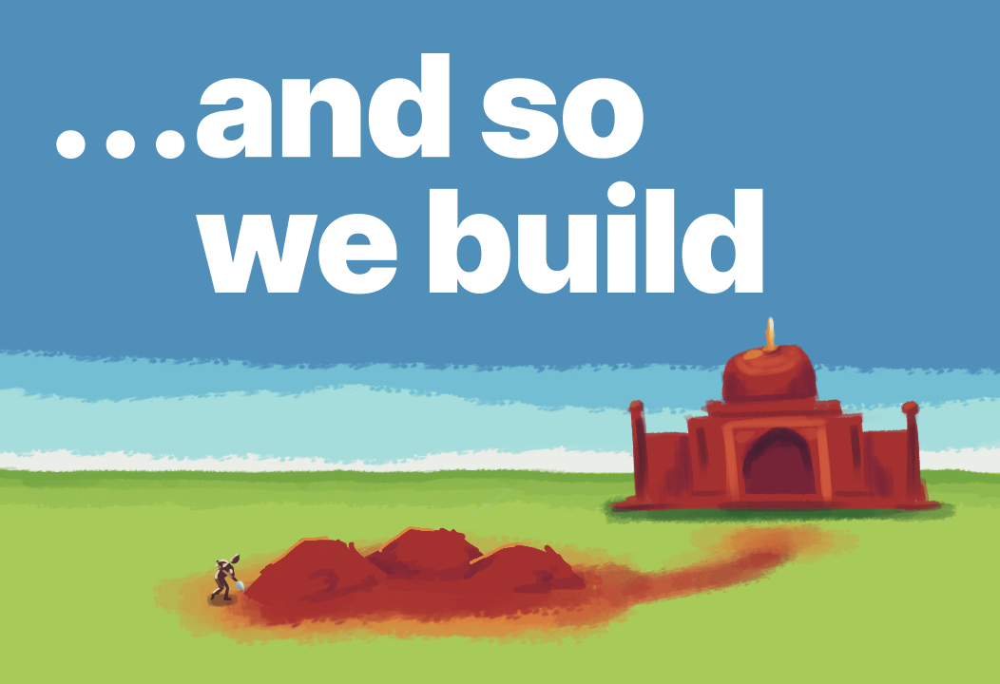
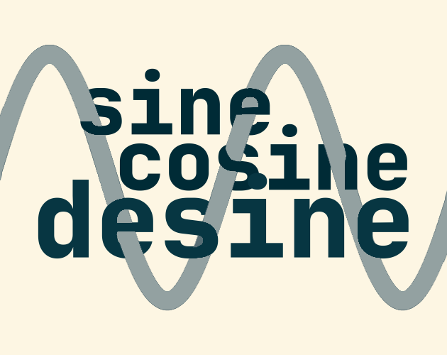
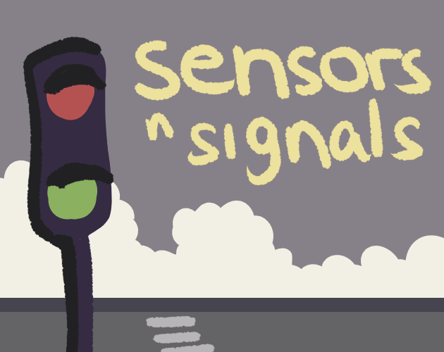
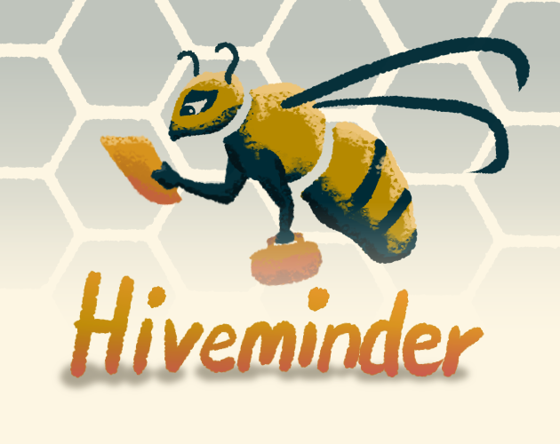

# haathi

Haathi is a simple game engine for zig and wasm.

---

## Example games:

#### [and so we build](https://chapliboy.itch.io/and-so-we-build)
A chill incremental game about building a grand monument - [source](https://github.com/samhattangady/mountain_core)

#### [Golden Goal](https://chapliboy.itch.io/golden-goal)
Relive the story of the goal that won the championship - [source](https://github.com/samhattangady/haathi/blob/master/src/goal.zig)

#### [sine cosine desine](https://chapliboy.itch.io/sine-cosine-desine) 
Use simple math functions to build up waveforms - [source](https://github.com/samhattangady/haathi/blob/master/src/synthelligence.zig)

#### [Sensors n Signals](https://chapliboy.itch.io/sensors-n-signals)
Create connections and clear intersections one signal at a time - [source](https://github.com/samhattangady/haathi/blob/master/src/drifter.zig)

#### [hiveminder](https://chapliboy.itch.io/hiveminder)
A simple toy city builder for bees - [source](https://github.com/samhattangady/haathi/blob/master/src/hiveminder.zig)

---

